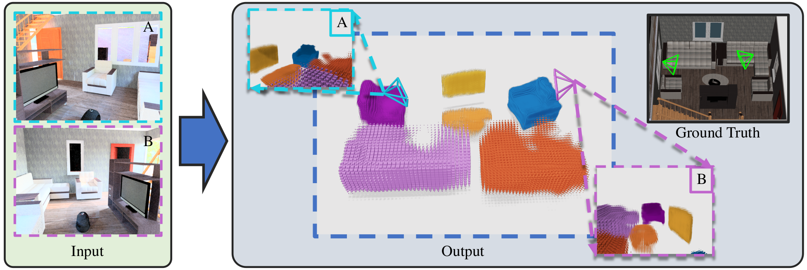

# Associative3D: Volumetric Reconstruction from Sparse Views

Code repository for the paper:

**Associative3D: Volumetric Reconstruction from Sparse Views**  
[Shengyi Qian](https://jasonqsy.github.io/)\*, [Linyi Jin](https://jinlinyi.github.io/)*, [David Fouhey](https://web.eecs.umich.edu/~fouhey/).  
ECCV 2020.

[paper] [[project page](https://jasonqsy.github.io/Associative3D/)]



## Setup

Coming soon.


## Citation

Please consider citing our paper if it is helpful:

```
@inproceedings{Qian2020,
    author = {Shengyi Qian and Linyi Jin and David F. Fouhey},
    title = {Associative3D: Volumetric Reconstruction from Sparse Views},
    booktitle = {ECCV},
    year = 2020
}
```
